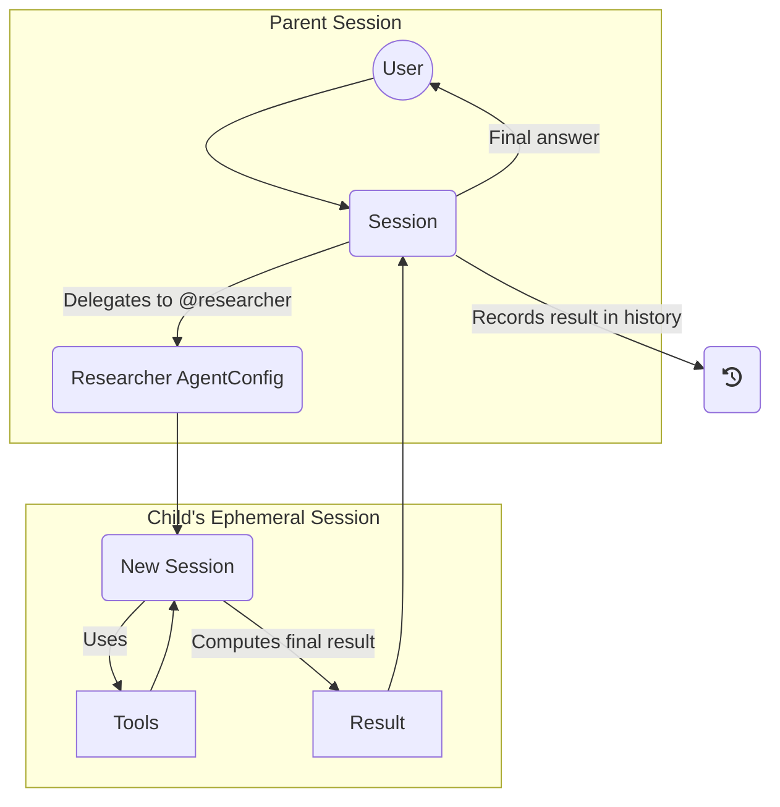

# Design

Notes on the design of this tool.

## Goals

- Simplify development with local large language models. Must be usable both as
  a CLI app and a library.
- Task oriented.
- Must support CPU based ggml models.
- Must be extensible for following dimensions. Preferably with configuration.
  - Newer models
  - Prompt formats
- Must support integration with other tools with in the ecosystem.
- Opinionated. Explicitly avoid dependency or feature bloat.

### Non Goals

We're not going to be build yet another index, or a semantic kernel like
`langchain`. We focus only on the language modeling aspect; not the storage or
anything else.

While these are true at the time of writing, we will be open to reconsider these
in the future.

- Training models are not supported. This is an inference library.
- GPU support is not available (due to lack of resource/testing environment).

### Better tools

We believe below tools are awesome and may be in the same bucket as this one.

- <https://github.com/simonw/llm>
- <https://github.com/go-skynet/LocalAI>
- <https://github.com/jmorganca/ollama>

## Architecture

### Clean Architecture Approach

We implement a layered architecture with clear separation of concerns:

1. **Core Crate**: Contains domain abstractions and foundational interfaces:
   - `Agent`: Traits for agent definitions and execution
   - `Workflow`: Step-by-step automation engines
   - `Tool`: Standardized tool interface
   - `Memory`: Short/long-term contextual storage

2. **Implementation Crates**: Concrete implementations in dedicated crates:
   - `agent-research`: Domain-specific agent
   - `memory-persistent`: Persistent storage
   - `tool-search`: Web search implementation

3. **CLI Crate (`arey`)**: Provides user experience with:
   - Top-level commands: `run`, `play`, `chat`
   - REPL engine with commands: `/log`, `/tool`, `@agent`, `!workflow`
   - Managed sessions with state persistence
   - Consistent UX components (styling, spinners)

### Key Concepts

- **Agent**: A stateless configuration that defines a persona and capabilities. It bundles a system prompt, a default set of tools, and model generation parameters (`ProfileConfig`). Agents are reusable templates for creating specialized conversational experiences.

- **Session**: A stateful, long-lived object that represents a single, continuous conversation. A session is instantiated from an `Agent` configuration and holds the complete message history. It is the primary entity that a user interacts with.

- **Nested Execution**: A `Session` can delegate a sub-task to a different `Agent`. When this happens, a new, temporary child `Session` is created from the child `Agent`'s configuration. This isolates the sub-task's context. Only the final result from the child session is returned to the parent, keeping the primary conversation history clean and efficient.

- **Tools**: Extend agent functionality through integrations like web search or file operations. A session's toolset is initialized from its agent, but can be dynamically modified for the duration of the session.

- **Workflows**: Predefined sequences of agent and tool invocations to automate complex, multi-step tasks.

- **REPL Engine**: Interactive chat environment with:
  - Command history
  - Context-aware autocomplete
  - Rich output formatting for agent and tool responses.

### Execution Flows

**Session Initialization and Interaction**
```mermaid
graph TD
    User((User)) -->|"arey chat --agent coder"| CLI
    CLI --> AgentRepo[Agent Repository]
    AgentRepo -->|Loads "coder" config| AgentConfig(AgentConfig)
    CLI -->|Instantiates with config| Session(Session State)
    User <-->|Interact| Session
    Session -->|Uses| Tools
    Session -->|Generates response via| Model[LLM]
```

**Nested Agent Invocation**


### Design Considerations and Mitigations

The introduction of nested agent execution introduces complexity. The following design choices are intended to mitigate these challenges while retaining power and flexibility.

- **Complexity**: By strictly separating the stateless `Agent` configuration from the stateful `Session`, we keep the core concepts clean. The primary user-facing API will interact with `Session`, which provides a simple conversational interface. Nested execution is an advanced feature that builds on this stable foundation without complicating the basic use case.

- **State Management**: The one-way dependency (`Agent` configures `Session`) prevents ambiguity. An agent definition can be safely reused to spawn multiple, independent sessions, ensuring predictable behavior and easier state management for the application.

- **Context Propagation**: Passing context to child agents is a critical and non-trivial problem. Instead of a one-size-fits-all solution, the parent session will be responsible for explicitly crafting a concise, task-specific prompt for the child agent. This prevents token waste and ensures the child has the necessary information without being overloaded by irrelevant history.

### Open Questions

- [ ] **Context Propagation Strategy**: What is the most effective and efficient way to summarize and pass context from a parent session to a child? Should this be a configurable strategy (e.g., "last_n_turns", "summary", "manual_prompt")?
- [ ] **Dynamic Tool Management**: How should the system prompt be updated when a tool is added or removed from a session mid-conversation? Does this require a full model reload, or can we manage it more gracefully?
- [ ] **Error Handling in Nested Calls**: How should errors from a child session (e.g., tool failure, generation error) be propagated to the parent? Should the parent be able to retry or intervene?
- [ ] **Circular Dependency Detection**: How do we prevent infinite loops where Agent A calls Agent B, which in turn calls Agent A? A maximum call depth is a simple first step, but more sophisticated cycle detection may be needed.

### Example Runs

**1. Agent-Based Research**
```bash
arey run @research "latest AI advancements"
```
1. Agent searches academic/public sources
2. Summarizes key findings
3. Provides search references

**2. Documentation Workflow**
```bash
arey run !generate_docs src/
```
1. Index source files
2. Generate API documentation stubs
3. Verify coverage
4. Output markdown

**3. Interactive Troubleshooting**
```bash
arey chat
> @support "Connection timeout error"
```
1. Support agent suggests diagnostics
2. Integrates log analysis tools
3. Provides repair steps
4. Maintains session state
