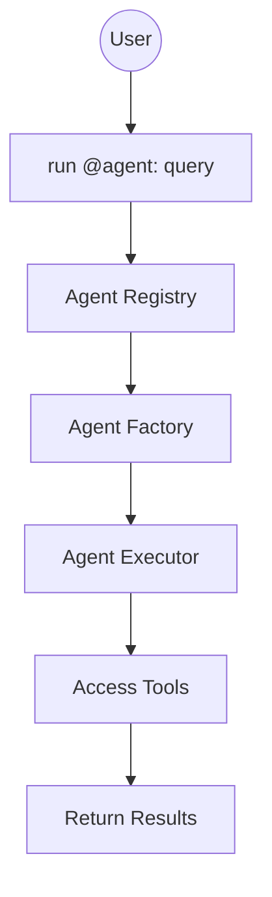
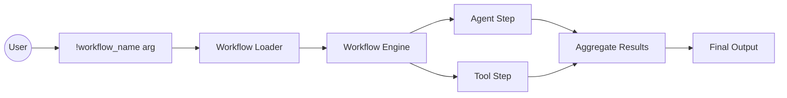

# Design

Notes on the design of this tool.

## Goals

- Simplify development with local large language models. Must be usable both as
  a CLI app and a library.
- Task oriented.
- Must support CPU based ggml models.
- Must be extensible for following dimensions. Preferably with configuration.
  - Newer models
  - Prompt formats
- Must support integration with other tools with in the ecosystem.
- Opinionated. Explicitly avoid dependency or feature bloat.

### Non Goals

We're not going to be build yet another index, or a semantic kernel like
`langchain`. We focus only on the language modeling aspect; not the storage or
anything else.

While these are true at the time of writing, we will be open to reconsider these
in the future.

- Training models are not supported. This is an inference library.
- GPU support is not available (due to lack of resource/testing environment).

### Better tools

We believe below tools are awesome and may be in the same bucket as this one.

- <https://github.com/simonw/llm>
- <https://github.com/go-skynet/LocalAI>
- <https://github.com/jmorganca/ollama>

## Architecture

### Clean Architecture Approach

We implement a layered architecture with clear separation of concerns:

1. **Core Crate**: Contains domain abstractions and foundational interfaces:
   - `Agent`: Traits for agent definitions and execution
   - `Workflow`: Step-by-step automation engines
   - `Tool`: Standardized tool interface
   - `Memory`: Short/long-term contextual storage

2. **Implementation Crates**: Concrete implementations in dedicated crates:
   - `agent-research`: Domain-specific agent
   - `memory-persistent`: Persistent storage
   - `tool-search`: Web search implementation

3. **CLI Crate (`arey`)**: Provides user experience with:
   - Top-level commands: `run`, `play`, `chat`
   - REPL engine with commands: `/log`, `/tool`, `@agent`, `!workflow`
   - Managed sessions with state persistence
   - Consistent UX components (styling, spinners)

### Key Concepts

- **Agents**: Specialized workers for focused tasks 
  - Execute queries with access to tools/memory
  - Can run in background during sessions
  - Discovered via registry pattern

- **Workflows**: Predefined sequences of steps:
  1. Agent invocations
  2. Tool usage
  3. Conditional operations
  4. Memory operations

- **Tools**: Extend functionality through:
  - Web search (`/search`)
  - File operations (`/file`) 
  - Custom integrations

- **Memory**: Context-aware storage:
  - Short-term: Session memory
  - Long-term: Vector stores 
  - Automatic retrieval augmentation

- **REPL Engine**: Interactive chat environment with:
  - Command history
  - Context-aware autocomplete
  - Rich output formatting

### Execution Flows

**Agent Invocation**


**Workflow Execution**


### Example Runs

**1. Agent-Based Research**
```bash
arey run @research "latest AI advancements"
```
1. Agent searches academic/public sources
2. Summarizes key findings
3. Provides search references

**2. Documentation Workflow**
```bash
arey run !generate_docs src/
```
1. Index source files
2. Generate API documentation stubs
3. Verify coverage
4. Output markdown

**3. Interactive Troubleshooting**
```bash
arey chat
> @support "Connection timeout error"
```
1. Support agent suggests diagnostics
2. Integrates log analysis tools
3. Provides repair steps
4. Maintains session state
