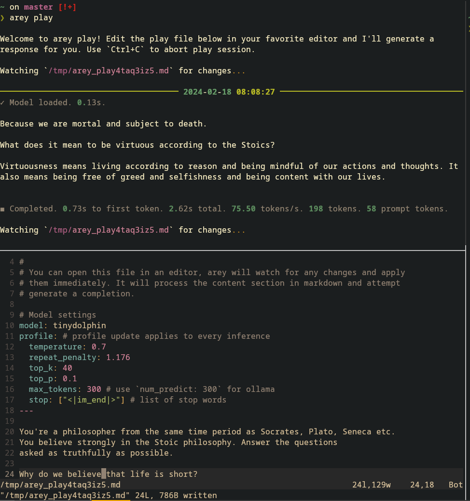

# Welcome to Arey

Arey is a command line playground app for local large language models. It
supports all the models supported by [Llama.cpp][] and [Ollama][]. If you have
your own LLM service with an [OpenAI][] compatible chat endpoint, we got you
covered too!

[Llama.cpp]: https://github.com/ggerganov/llama.cpp
[Ollama]: https://ollama.com
[OpenAI]: https://platform.openai.com/docs/api-reference/chat

## Install

We recommend using `pipx` to install the app in an isolated python virtual
environment.

```sh
# Install pipx if needed: `pip install pipx`
# Ensure ~/.local/bin is available in system PATH
pipx install arey
```

You can upgrade to latest version of the app using `pipx upgrade arey`.

## Commands

- `arey chat` - Start a chat session with local AI model.
- `arey ask [query]` - Ask the AI model to help with \[query\].
- `arey play` - Create a playground file, edit the file and generate AI
  response.
- `arey --help` - Print help message and exit.

## Configure

On the first run, `arey` will create a configuration file in following location:

- `~/.config/arey/arey.yml` for Linux or Mac systems.
- `~/.arey/arey.yml` for Windows.

Please update the `models` section in the config yml to your local model path.

### Get the model

For this quick start guide, let's download the [Tiny Dolphin][] model locally.

[Tiny Dolphin]: https://huggingface.co/s3nh/TinyDolphin-2.8-1.1b-GGUF

```sh
$ mkdir ~/models
$ cd ~/models

# If wget is not available on your platform, open the below link
# in your browser and save it to ~/models.
# Size of this model: ~668MB
$ wget https://huggingface.co/s3nh/TinyDolphin-2.8-1.1b-GGUF/resolve/main/tinydolphin-2.8-1.1b.Q4_K_M.gguf

# ...
$ ls
tinydolphin-2.8-1.1b.Q4_K_M.gguf
```

??? note "Where to find models?"

    You can find Llama.cpp compatible models by searching for `gguf` in
    <https://huggingface.co/models?search=gguf>.

    <https://huggingface.co/TheBloke> has a good collection of models you can
    use locally.

    We recommend the Q4_K_M or Q5_K_M quantized models.

### Update configuration

Let's add an entry for this model in arey's config file.

```yaml linenums="1" hl_lines="7-10 38 41"
# Example configuration for arey app
#
# Looked up from XDG_CONFIG_DIR (~/.config/arey/arey.yml) on Linux or
# ~/.arey on Windows.

models:
  tinydolphin:
    path: ~/models/tinydolphin-2.8-1.1b.Q4_K_M.gguf
    type: llama
    template: chatml
  ollama-tinydolphin:
    name: tinydolphin:latest # name of the model, see http://localhost:11434/api/tags
    type: ollama
    template: chatml

profiles:
  # See https://www.reddit.com/r/LocalLLaMA/comments/1343bgz/what_model_parameters_is_everyone_using/
  precise:
    # factual responses and straightforward assistant answers
    temperature: 0.7
    repeat_penalty: 1.176
    top_k: 40
    top_p: 0.1
  creative:
    # chatting, storywriting, and interesting assistant answers
    temperature: 0.72
    repeat_penalty: 1.1
    top_k: 0
    top_p: 0.73
  sphinx:
    # varied storywriting (on 30B/65B) and unconventional chatting
    temperature: 1.99
    repeat_penalty: 1.15
    top_k: 30
    top_p: 0.18

chat:
  model: tinydolphin
  profile: precise
task:
  model: tinydolphin
  profile: precise
```

Noteworthy changes to the configuration file:

1. **Line 11-14**: we added a new model definition with the path of the downloaded model.
2. **Line 38**: we instruct `arey` to use `tinydolphin` model for chat.
3. **Line 41**: `arey` will use `tinydolphin` for the queries in ask command.

## Chatting with the model

Let's run `arey chat` to start a chat session. See below for an illustration.

```sh
❯ arey chat
Welcome to arey chat!
Type 'q' to exit.

✓ Model loaded. 0.13s.

How can I help you today?
> Who are you?

I am an artificial intelligence model that has been programmed to simulate human behavior, emotions, and responses based on data gathered from various sources. My primary goal is to provide
assistance in various areas of life, including communication, problem-solving, decision-making, and learning.


◼ Completed. 0.49s to first token. 2.10s total. 75.58 tokens/s. 159 tokens. 64 prompt tokens.
>
```

`chat` command will simulate a conversation with the configured AI model. In
every turn, it will send all messages between you and the AI model as context
and ask the AI model to generate a suitable response.

## Ask anything

`arey ask` command provides a quick way to run any query on the terminal.
Compared to the `chat` command, `ask` will not use any session or conversation
history.

```sh
❯ arey ask "Who are you?"

Welcome to arey ask!

✓ Model loaded. 0.13s.

I am an artificial intelligence model that has been programmed to interact with humans through text-based conversations. My primary goal is to provide assistance, support, or information as
requested, but my responses can vary based on the context of the conversation.


◼ Completed. 0.52s to first token. 1.97s total. 72.62 tokens/s. 143 tokens. 67 prompt tokens.
```

## Playground

`arey play` allows you to fine-tune a prompt. It uses a simple markdown file to
represent completion settings and the prompt. On every save, `arey` will try to
generate a response for the prompt.

In the below screenshot, we have two terminals. `arey play` is running the top
terminal, it created a play file and continues to monitor it for any changes. In
the bottom terminal, we edit the file and upon save we can see the generated
response in top terminal.



## Next steps

See the detailed guides for [Llama.cpp](llama.md) and [Ollama](ollama.md).
